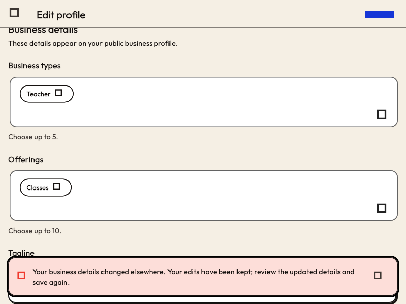

# Business profile save recovery

Business detail editing and product management share the versioned
`social.craftsky.business.profile/self` record. Display-safe profile responses
can omit unsupported product fields, so copying those responses into a full
replacement could reject an unrelated detail edit or discard independent data.

`PUT /v1/profiles/me/business` now accepts two optional API-only controls:

- `preserveProducts: true`: omit `products` from the request. AppView copies the
  current PDS record's raw products into the replacement. Supplying both is a
  validation error, including an explicitly empty array.
- `preserveUnknownCatalogValues: true`: submit only recognized business types
  and offerings. AppView retains existing unrecognized values from the PDS
  while replacing the recognized selections. The combined collection must
  remain within the lexicon's twenty-value bound.

These controls are included in immutable command intent but never in the PDS
record. Omitting them keeps the original full-replacement contract. New product
writes still require valid images, and new taxonomy selections still require
recognized values. No lexicon or route changes are introduced.

Flutter detail saves use both controls; product saves use only the catalog
control. Accepted-write reconciliation compares the resulting profile projection
rather than the request controls.

A business save conflict refreshes the owner's AppView profile without writing
again automatically. When a newer record version is available, the editor keeps
locally edited fields, updates untouched fields, and uses the new version for
an explicit retry with a new operation key. Failed or still-stale refreshes
retain the draft and original version. Account/session changes fence refresh
completion. Validation errors name the affected field; product errors direct
the member to featured products in Settings.

## Conflict recovery screenshot

Captured from the widget test fixture; icon and font fallbacks differ from a
normal app build.
