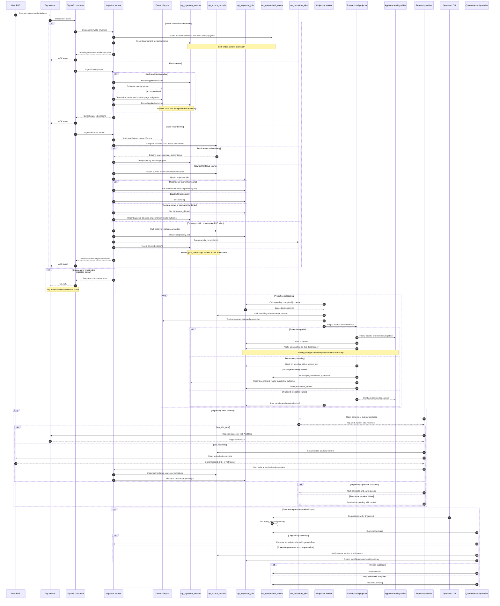

# Tap ingestion durability flow

This document shows how CraftSky receives AT Protocol repository events from
Tap, commits a durable acknowledgement boundary, and asynchronously projects
the retained source into the AppView's user-facing tables.

The five principal durability tables are:

- `tap_ingestion_receipts`: the idempotent ledger of durably handled events.
- `tap_source_records`: the latest retained source record or delete tombstone
  for each AT URI.
- `tap_projection_jobs`: the durable queue for materializing retained sources
  into serving tables.
- `tap_quarantined_events`: bounded evidence and replay state for invalid
  events or sources.
- `tap_repository_jobs`: durable repository registration and authoritative PDS
  reconciliation work.

## Critical acknowledgement boundary

The Tap consumer sends an ACK only after CraftSky has committed an
acknowledgable outcome. For a valid record, that transaction retains the source
state, creates or updates its downstream work, and writes an ingestion receipt.
For invalid input, it commits quarantine evidence and a receipt. A retryable or
storage failure is not acknowledged, allowing Tap to redeliver it.

Projection is deliberately outside this ACK deadline. The projection,
repository, and replay workers use expiring leases so unfinished work survives
process crashes and can be reclaimed safely.
